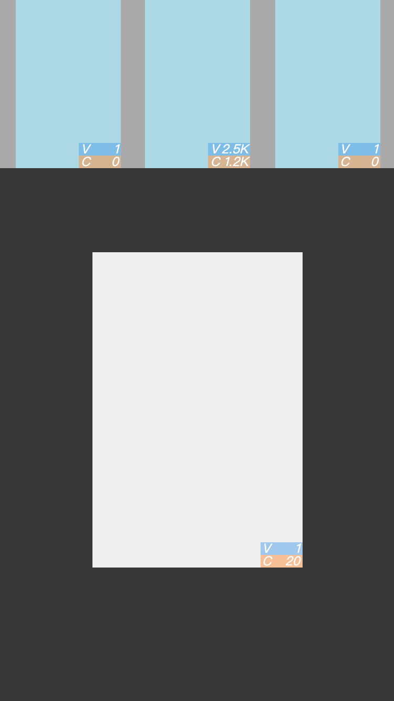

# auto-view-plugin-check   
查看打点数据的 [auto-view](https://github.com/find-qin/auto-view) 插件，支持检测当前上报 mv/mc

### notice  
- 插件使用 ES2015 语法，包含 Map 使用，如果需要 ES5 环境运行，请自行做好 Polyfill
- 插件会改变文档流中的元素样式，插入元素节点

### Usage
``` javascript

import autoView from '@findqin/auto-view'
import autoViewPluginCheck from '@findqin/auto-view-plugin'

autoView({
    onElemView: (vid, vdata) => {},
    onElemClick: (vid, vdata) => {},
    plugins: [
        autoViewPluginCheck()
    ]
})
```

### demo



V - 曝光量
C - 点击量(下面模块手动点了20次 🙂)

上图展示了打点数据情况：  
- 1. 可以用来查看页面每个点的数据是多少 - 支持单位 K M T
- 2. 可以用来开发时测试当前打点情况 - 一目了然
